# 🎙️ audio-glance

**마이크 음소거 · 출력 장치 · 볼륨을 흘깃 보고 바로 바꾸는 Windows 위젯**

서브모니터 구석에 띄워 두면 **마이크가 켜져 있는지, 소리가 어디로 나가는지** 한눈에 보여요.
음소거면 위젯이 빨갛게 바뀌고, 스피커 ↔ 이어폰 전환 · 앱별 볼륨 · 모니터 밝기까지 위젯과 단축키로 바로 바꿔요.

  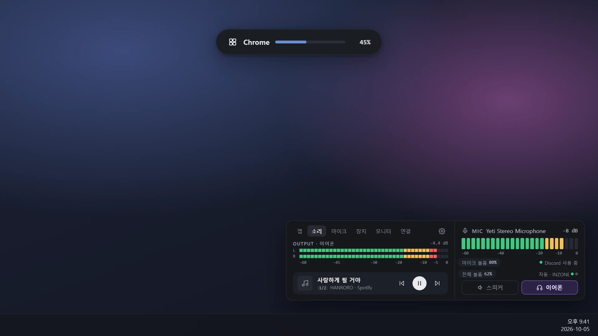

## 📸 둘러보기

### 마이크 칸은 늘 보여요 · 음소거면 빨갛게
위젯 오른쪽 **마이크 칸**에 마이크 소리 크기(미터)와 이름이 늘 보여요. 어느 탭을 보고 있어도 그대로예요.
**누르면 음소거**, 다시 누르면 풀려요. 음소거면 빨간 덮개가 씌워지고 위젯 테두리도 빨개져요.
마이크가 빠지면 주황색으로 알려 줘요 (음소거와 헷갈리지 않게).

  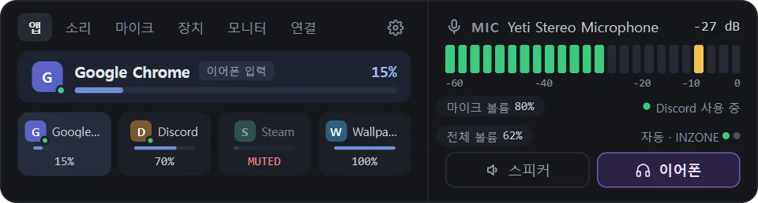

### 스피커 ↔ 이어폰 한 번에
**[스피커] [이어폰]** 버튼으로 소리 나오는 장치를 바꿔요. 어느 장치를 쓸지는 설정에서 한 번 골라 두면 돼요.
그 위 **전체 볼륨 %** 에서 휠을 굴리면 전체 볼륨, 누르면 전체 음소거예요.

  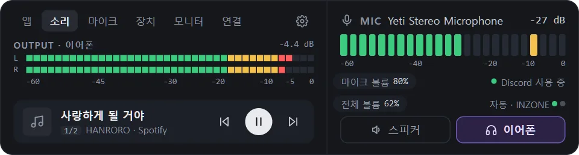

### 앱마다 볼륨
**앱** 탭에는 소리를 내는 프로그램이 모여요. 위 큰 카드에서 **휠을 굴리면 그 앱 볼륨**, 누르면 그 앱만 음소거.
아래 목록을 누르면 위로 올라오고, 소리 나는 앱엔 초록 점이 켜져요.
앱마다 볼륨을 기억하고, **스피커일 때 · 이어폰일 때 따로** 기억해요.

  

### 탭 여섯 개

<table>
  <tr>
    <td align="center" width="50%">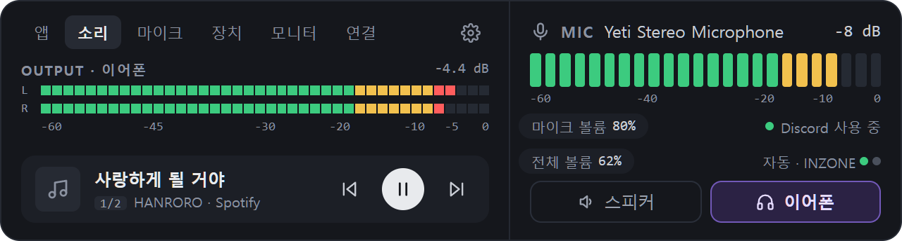</td>
    <td align="center" width="50%">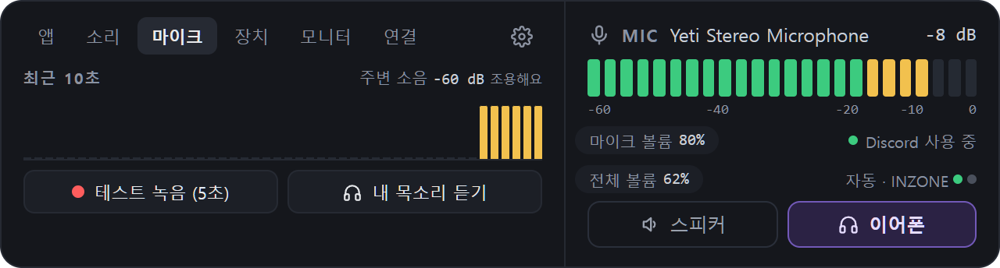</td>
  </tr>
  <tr>
    <td align="center"><b>소리</b> 출력 레벨 미터 · 재생 중인 곡 (이전 · 재생 · 다음)</td>
    <td align="center"><b>마이크</b> 최근 10초 그래프 · 방 소음 · 5초 테스트 녹음 · 내 목소리 듣기</td>
  </tr>
  <tr>
    <td align="center">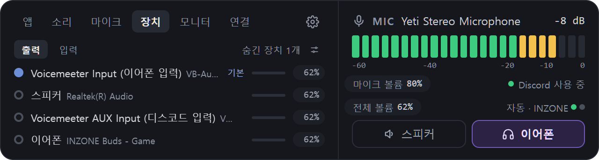</td>
    <td align="center">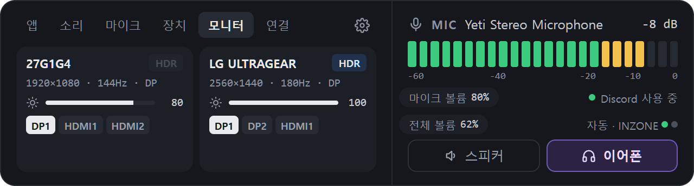</td>
  </tr>
  <tr>
    <td align="center"><b>장치</b> 누르면 기본 장치로 · 장치별 볼륨 · 레벨</td>
    <td align="center"><b>모니터</b> 밝기 · 명암 · 해상도 · 주사율 · HDR · 입력 바꾸기</td>
  </tr>
  <tr>
    <td align="center">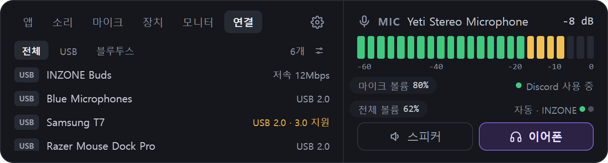</td>
    <td align="center">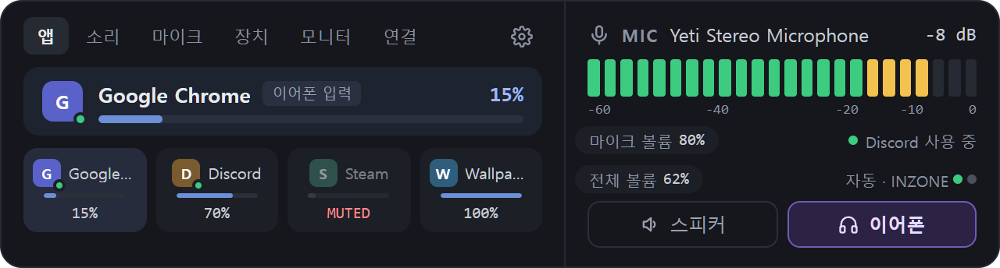</td>
  </tr>
  <tr>
    <td align="center"><b>연결</b> USB 장치 · 속도 (느린 포트는 주황) · 블루투스 오디오 연결/끊기</td>
    <td align="center"><b>앱</b> 앱별 볼륨 · 음소거 · 소리 나는 앱 초록 점</td>
  </tr>
</table>

### 팝업 · 트레이

음소거 · 볼륨 · 출력 전환 · 장치 연결이 바뀌면 화면에 잠깐 팝업이 떠요 (포커스를 뺏지 않고 클릭도 통과).
띄울 **모니터와 자리(9곳)** 를 고를 수 있어요.

<table>
  <tr>
    <td align="center"></td>
    <td align="center"></td>
    <td align="center"></td>
  </tr>
</table>

작업 표시줄 **트레이 아이콘**도 마이크 상태를 보여 줘요: 말할 때 초록 점 · 조용하면 회색 · 음소거 빨강 · 마이크 없음 주황.
트레이나 위젯을 **오른쪽 클릭**하면 음소거 · 출력 바꾸기 · 항상 위 · 위치 잠금 · 크기 같은 메뉴가 나와요.

### 설정 · 처음 안내 · 업데이트

<table>
  <tr>
    <td align="center" width="50%">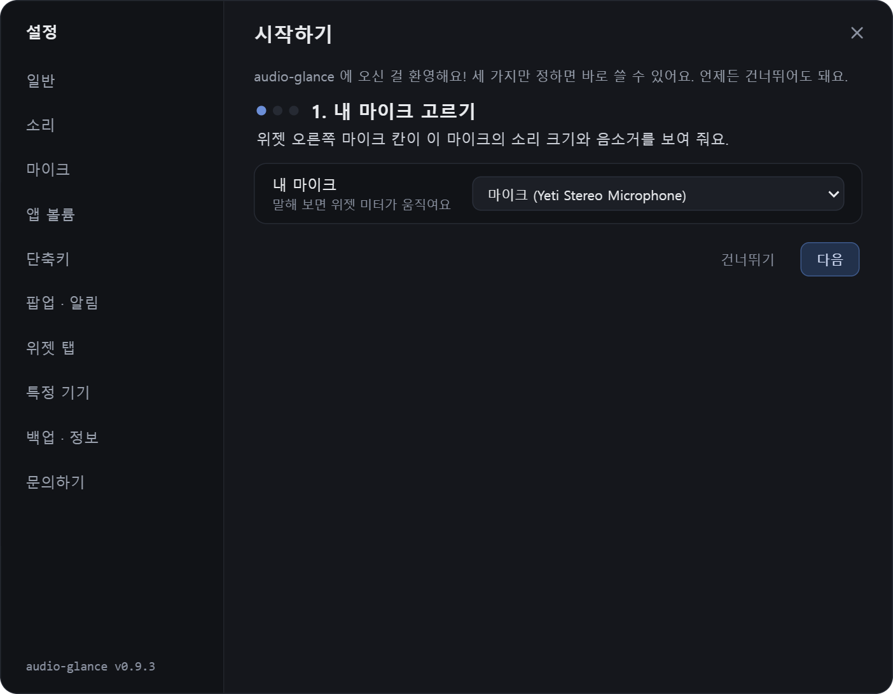</td>
    <td align="center" width="50%">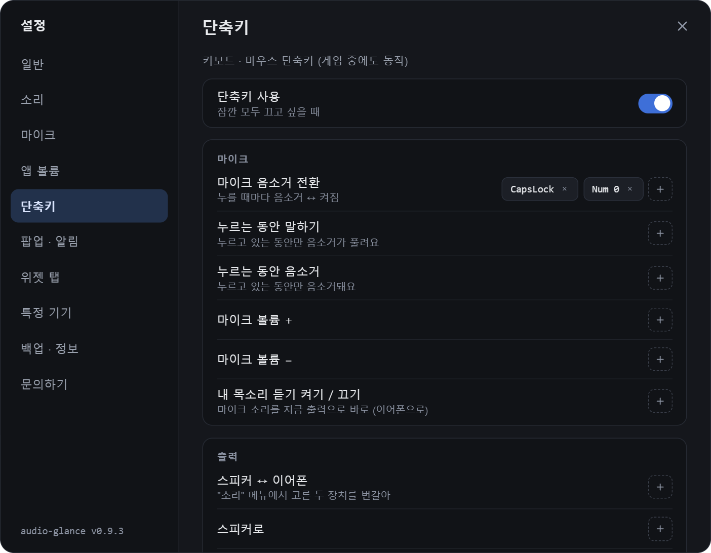</td>
  </tr>
  <tr>
    <td align="center"><b>처음 켜면</b> 내 마이크 → 스피커 · 이어폰 버튼 → 음소거 단축키 3단계</td>
    <td align="center"><b>단축키</b> 키를 눌러서 등록 · 키 하나 또는 조합 · 마우스 휠 조합</td>
  </tr>
  <tr>
    <td align="center">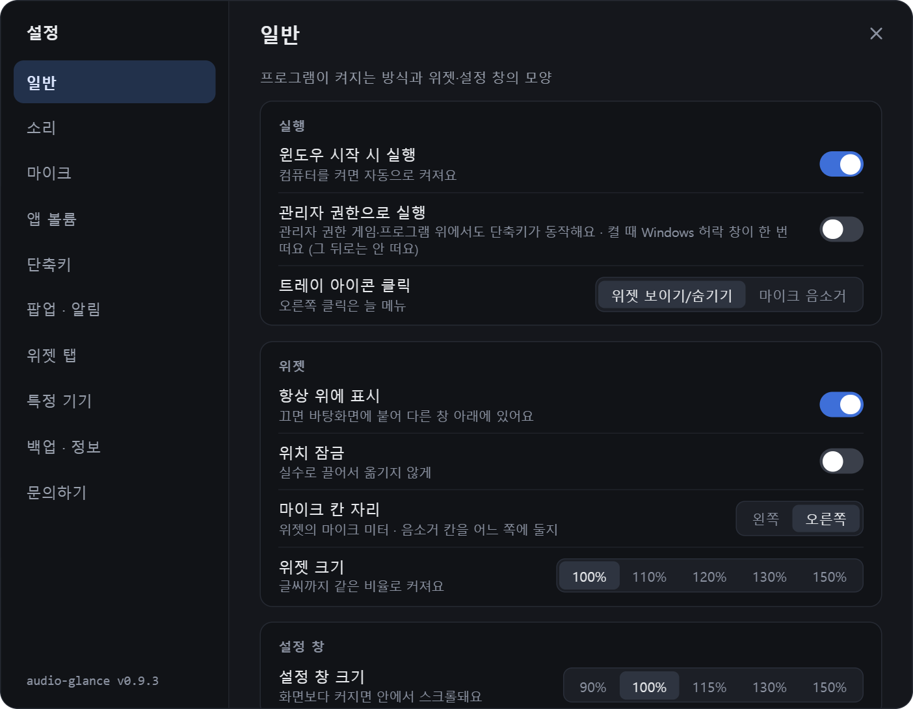</td>
    <td align="center">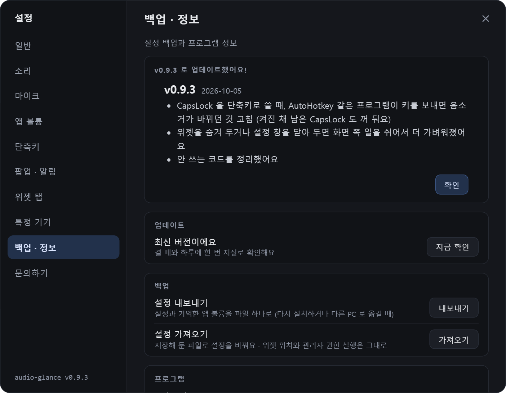</td>
  </tr>
  <tr>
    <td align="center"><b>설정</b> 바꾸면 바로 적용 · 메뉴 10개</td>
    <td align="center"><b>업데이트</b> 업데이트하면 바뀐 점을 한 번 보여 줘요</td>
  </tr>
</table>

사진 속 장치 · 앱 · 곡 이름은 모두 예시예요.

---

## ⬇️ 설치하기

1. 오른쪽 **Releases** 에서 가장 위(Latest) 버전을 열어요.
2. **`AudioGlance_버전_x64-setup.exe`** 하나만 받아서 실행해요.
   (다른 파일 `latest.json`, `.sig` 는 자동 업데이트용이라 받지 않아도 돼요.)
3. 설치가 끝나면 위젯이 뜨고, 처음엔 **시작하기** 안내가 열려요.

> **"Windows의 PC 보호" 파란 창이 뜨면?**
> 아직 널리 알려지지 않은 개인 프로그램이라 윈도우가 한 번 확인하는 창이에요.
> **추가 정보 → 실행** 을 누르면 설치돼요.

- 관리자 권한 없이 **내 계정에만** 설치돼요.
- 필요한 것: Windows 10 / 11 (64비트)
- 윈도우를 켤 때 같이 켜려면: **설정 → 일반 → 윈도우 시작 시 실행**
- 지우려면: 윈도우 **설정 → 앱 → 설치된 앱 → AudioGlance → 제거**. 자동 실행 · 관리자 실행 등록도 같이 지워져요.
  설정 폴더는 남아 있어서 다시 설치하면 그대로 이어져요 (제거 화면에서 "앱 데이터 삭제"를 고르면 같이 지워요).

## 🔄 자동 업데이트

새 버전이 나오면 알아서 알려 줘요. 켤 때, 그리고 하루 한 번 확인해요.

- 위젯 **톱니 버튼에 초록 점**, 트레이 메뉴 맨 위에 "**새 버전으로 업데이트**", 설정 **백업 · 정보** 에 업데이트 버튼이 생겨요.
- 누르면 받아서 설치하고 다시 켜져요. **누르기 전에는 아무것도 바뀌지 않아요.**
- 업데이트하면 **바뀐 점** 을 한 번 보여 줘요. 지난 내용은 **설정 → 백업 · 정보 → 업데이트 내역** 에 있어요.
- 모든 업데이트 파일에는 **디지털 서명** 이 붙어 있어요. 서명이 맞는 파일만 설치해요.

---

## 🎛️ 이렇게 써요

| 하고 싶은 것 | 방법 |
|---|---|
| 마이크 음소거 / 해제 | 마이크 칸 클릭 · 음소거 단축키 · 트레이 오른쪽 클릭 |
| 마이크 볼륨 | 마이크 칸 위에서 휠 (**마이크 볼륨 %**) |
| 전체 볼륨 · 전체 음소거 | **전체 볼륨 %** 위에서 휠 · 클릭 |
| 스피커 ↔ 이어폰 | **[스피커] [이어폰]** 버튼 · 단축키 (장치는 **설정 → 소리** 에서 한 번 고르기) |
| 앱 볼륨 | **앱** 탭 위 카드에서 휠 · 단축키로는 마우스 올린 창(또는 활성 창)의 앱 |
| 기본 장치 바꾸기 | **장치** 탭에서 장치 줄 클릭 · % 위 휠 = 장치 볼륨 · % 클릭 = 장치 음소거 |
| 재생 중인 곡 | **소리** 탭 카드의 이전 · 재생/일시정지 · 다음. 여러 앱이 재생 중이면 카드 위 휠로 넘기기 |
| 내 마이크 들어 보기 | **마이크** 탭: 5초 녹음해서 바로 듣기 · 내 목소리 바로 듣기 |
| 모니터 밝기 | **모니터** 탭 막대 위에서 휠 (해 아이콘을 누르면 명암). 모니터 메뉴에서 DDC/CI 가 켜져 있어야 해요 |
| 해상도 · 주사율 · HDR | 해상도 글자 클릭 → 고르기 (15초 안에 **유지** 를 안 누르면 되돌아가요) · HDR 칩 클릭 |
| 모니터 입력 바꾸기 | 입력 칩을 **두 번** 누르기 (화면이 꺼질 수 있어서) |
| 블루투스 이어폰 연결 · 끊기 | **연결** 탭의 [연결] [끊기] |
| 위젯 옮기기 | 위젯을 끌기 (켤 때 같은 자리) · 오른쪽 클릭 → 위치 잠금 |
| 위젯 숨기기 / 보이기 | 트레이 아이콘 클릭 · 단축키 |
| 크기 · 마이크 칸 자리 | 위젯 오른쪽 클릭 → 크기 · 마이크 칸 (왼쪽/오른쪽) · 설정 → 일반 |

### ⌨️ 단축키
**설정 → 단축키** 에서 [+] 를 누르고 쓰고 싶은 키를 누르면 등록돼요. 처음엔 비어 있어요.
키 하나만(CapsLock, Num 0 …), 조합(Ctrl+Alt+M …), 마우스 휠 조합(Alt+휠 …) 다 돼요. 게임 중에도 동작해요.

| 묶음 | 동작 |
|---|---|
| 마이크 | 음소거 전환 · 누르는 동안 말하기 · 누르는 동안 음소거 · 마이크 볼륨 ± · 내 목소리 듣기 |
| 출력 | 스피커 ↔ 이어폰 · 스피커로 · 이어폰으로 |
| 볼륨 | 전체 볼륨 ± · 앱 볼륨 ± · 전체 음소거 |
| 그 밖에 | 재생/일시정지 · 다음 곡 · 이전 곡 · 위젯 보이기/숨기기 · 모니터 밝기 ± |

- **관리자 권한으로 돌아가는 게임 위에서 단축키가 안 먹으면** **설정 → 일반 → 관리자 권한으로 실행** 을 켜 주세요 (켤 때 허락 창 한 번).
- AutoHotkey · Volume2 같은 다른 프로그램에서 **같은 키** 를 쓰고 있으면 두 번 바뀌어요. 그쪽 키는 꺼 주세요.

### 그 밖의 기능
- **화면 잠금(Win+L) 하면 음소거**, 풀면 원래대로 · **켤 때 음소거로 시작** · 음소거 **효과음**
- **기본 마이크 고정**: 다른 프로그램이 기본 마이크를 바꾸면 내 마이크로 되돌려요
- **CLIP 경고**: 마이크 소리가 너무 커서 찢어지면 dB 자리에 빨간 CLIP
- **팝업 잠깐 끄기**: 방송 · 화면 공유 중일 때 (트레이 메뉴에서도)
- **특정 기기**: Sony INZONE Buds 동글이 있으면 이어폰을 꺼낼 때 이어폰으로 · 넣으면 스피커로 자동 전환 / Voicemeeter 같은 가상 오디오 장치를 쓰면 그 프로그램 볼륨을 출력 볼륨으로
- 앱 이름 · 숨긴 앱 · 위젯에 보일 장치 · 모니터 · USB · 블루투스를 고를 수 있어요
- 글꼴 · 위젯 크기 · 설정 창 크기

---

## 💾 설정은 어디에?

설정은 **내 컴퓨터에만** 저장돼요.

- 위치: `%USERPROFILE%\.audioglance\` (예: `C:\Users\내이름\.audioglance`)
- **설정 → 백업 · 정보 → 설정 내보내기 / 가져오기** 로 파일 하나에 담아 옮길 수 있어요 (다시 설치하거나 다른 PC 로).
- 문제가 생기면 같은 폴더의 `log.txt` (기록 파일)를 보면 원인을 찾기 쉬워요.

## 💌 문의 · 버그 제보

앱 안 **설정 → 문의하기** 에서 만든 사람에게 바로 보낼 수 있어요.

- 보내지는 것: 적은 글, 종류(버그 · 제안 · 기타), 적었다면 연락처, 앱 버전 · 윈도우 버전
- **기록 파일은 직접 체크했을 때만** 같이 보내요 (오디오 장치 · 모니터 이름이 들어 있어요).

## 🍃 가볍게

변화는 Windows 알림으로만 받고, 계속 확인하지 않아요. 미터는 위젯이 보일 때만 화면에 그려요.

| 상황 (Ryzen 7 7800X3D) | CPU | 메모리 |
|---|---|---|
| 가만히 | 약 0.1% | 약 100MB |
| 말하기 · 볼륨 단축키 꾹 · 음악 재생 | 1% 아래 | 약 150MB |

---

Tauri · Rust 로 만들었어요. 이 저장소는 설치 파일과 자동 업데이트 파일을 나눠 주는 곳이에요.
